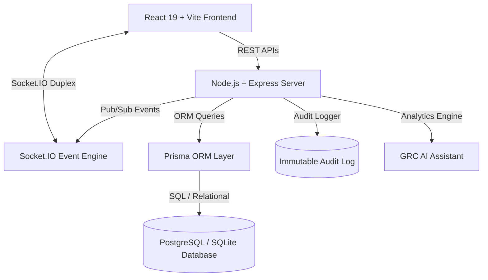

# Enterprise GRC Platform Architecture

## Architectural Blueprint

The platform implements **Clean Architecture** on the backend and **Feature-Sliced Design (FSD)** on the frontend to guarantee separation of concerns, enterprise scalability, high testability, and zero cloud dependencies.

---

## Backend Clean Architecture Layers

1. **Domain Layer**: Contains immutable domain interfaces, entity models, permissions matrix (`/shared`).
2. **Application Layer**: Business use cases, data transfer objects (DTOs), event publishers.
3. **Infrastructure Layer**: Prisma ORM database drivers, Socket.IO WebSockets hub, JWT token generation, PDF/CSV report generators, AI Assistant query processor.
4. **Presentation Layer**: Express Controllers, REST Routers, and RBAC authentication middlewares.

---

## Event-Driven WebSockets Pipeline

Every state-modifying action (e.g. assigning an asset to an employee, updating risk matrix scores, closing security incidents) emits a typed event over Socket.IO:

- `ASSET_ASSIGNED`: Automatically updates Employee Profile, Asset Inventory, React Flow Network Diagram, Audit Logs, and Notification Center without browser refresh.
- `RISK_UPDATED`: Refreshes Executive KPIs and 5x5 Heatmap Matrix in real time across all connected user sessions.
