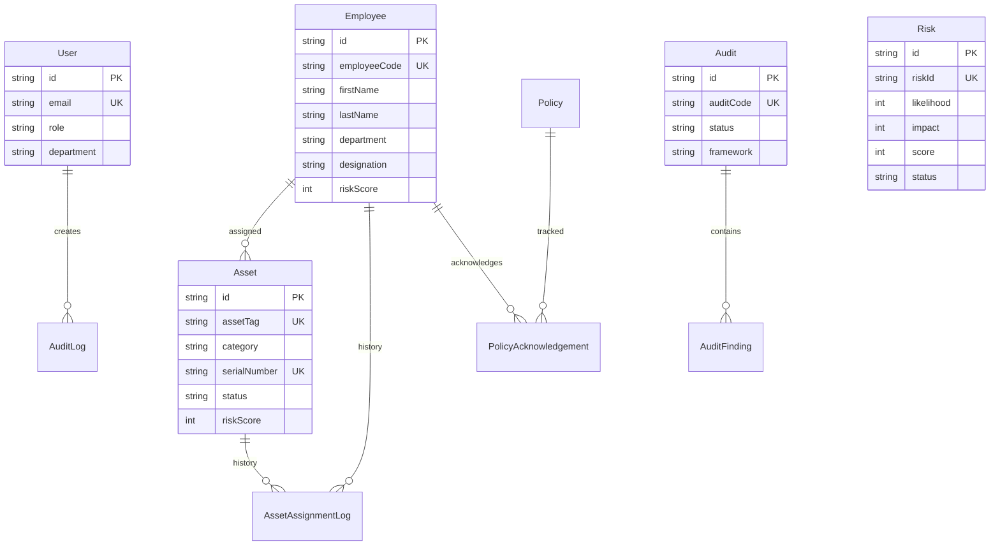

# Database Entity Relationship (ER) Diagram

The system employs a normalized relational database schema managed via Prisma ORM.

```mermaid
erDiagram
    User ||--o{ AuditLog : creates
    Employee ||--o{ Asset : "assigned"
    Employee ||--o{ AssetAssignmentLog : "history"
    Employee ||--o{ PolicyAcknowledgement : "acknowledges"
    Asset ||--o{ AssetAssignmentLog : "history"
    Audit ||--o{ AuditFinding : "contains"
    Policy ||--o{ PolicyAcknowledgement : "tracked"

    User {
        string id PK
        string email UK
        string role
        string department
    }

    Employee {
        string id PK
        string employeeCode UK
        string firstName
        string lastName
        string department
        string designation
        int riskScore
    }

    Asset {
        string id PK
        string assetTag UK
        string category
        string serialNumber UK
        string status
        int riskScore
    }

    Risk {
        string id PK
        string riskId UK
        int likelihood
        int impact
        int score
        string status
    }

    Audit {
        string id PK
        string auditCode UK
        string status
        string framework
    }
```
